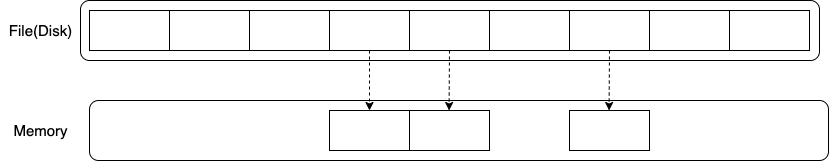

# Transaction

## 트랜잭션(Transaction)이란?

> Transaction

- 트랜잭션이란 질의를 모두 수행하거나 수행하지 않는 `작업수행의 논리적 단위`
- 트랜잭션은 일반적으로 script로 작성되어 절차적으로 수행
  - 이 script의 시작~끝까지를 `하나의 단위화`한 것
  - 하나의 절차라도 실패시 DB는 스스로 `Rollback`을 수행
  - 모든 절차가 성공적으로 종료되면 DB는 `Commit`을 수행
- DBMS의 성능은 초당 트랜잭션 실행 수 (`TPS` : Transaction Per Second)로 측정

> 트랜잭션을 사용하는 이유

- DB 서버는 하나의 클라이언트가 접근하는 것이 아닌 `동시`에 `여러 클라이언트`가 접근을 시도
- 이때, DB 작업을 처리하는 과정에서 문제가 발생하는 경우 `데이터 부정합`이 일어나는 것을 방지하기 위해서

## 트랜잭션의 특성

- 트랜잭션의 특성은 4가지로 `ACID`라고 함
- `원자성 (Atomicity)`
  - 트랜잭션 작업이 부분적으로 실행되거나 중단하지 않는 것을 보장함
  - All Or Nothing의 개념으로 모든 작업은 부분적인 단위로 수행하는 것이 아님을 의미
- `일관성 (Consistency)`
  - 트랜잭션이 성공적으로 완료되면 일관적인 DB상태를 유지하는 것
  - 트랜잭션의 대표 예제인 송금문제에서 트랜잭션 완료 후 정수형인 금액이 갑자기 문자열로 변경되거나 하지 않는다는 것을 의미
- `격리성 (Isolation)`
  - 트랜잭션 수행시 다른 트랜잭션이 끼어들지 못하게 하는 것
- `지속성 (Durability)`
  - 성공적으로 수행한 트랜잭션은 영원히 반영되는 것
  - Commit을 하면 현재 상태는 영원히 보장됨

> Rollback과 Commit

- DB를 변화하는 transaction 수행시 Disk의 파일에서 해당 부분을 메모리로 복제
- 메모리 상의 데이터들만 transaction에 있는 변화를 수행함
- 아래 설명하는 방법들은 DBMS에 따라 다를 수 있음

1. Rollback

- 만약 트랜잭션 수행 중 특성 작업에서 문제가 발생해서 트랜잭션 수행 실패시 작업을 중단

- 이후 메모리로 복제한 데이터를 날려버리는 방법으로 Rollback을 수행하여 원본 데이터베이스를 유지함

2. Commit

- 모든 작업이 정상적으로 완료되면, 정상 종료를 의미하는 Commit을 수행

- Commit을 수행하면 메모리의 변화한 데이터를 disk의 원본 데이터로 write

## Reference

- [victolee - 트랜잭션과 ACID 특성을 보장하는 방법](https://victorydntmd.tistory.com/129)
- [널널한 개발자 - DB 트랜잭션에 대해서 말해보세요.](https://www.youtube.com/watch?v=7yuGlqPo8XQ)
